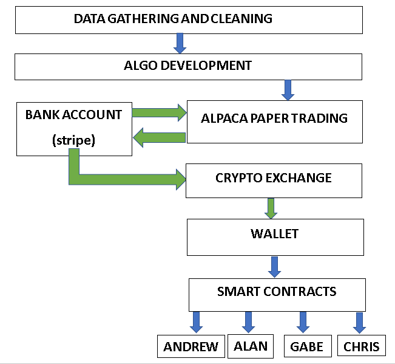
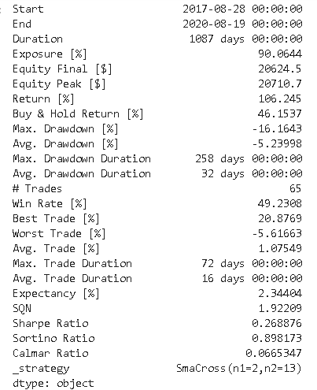
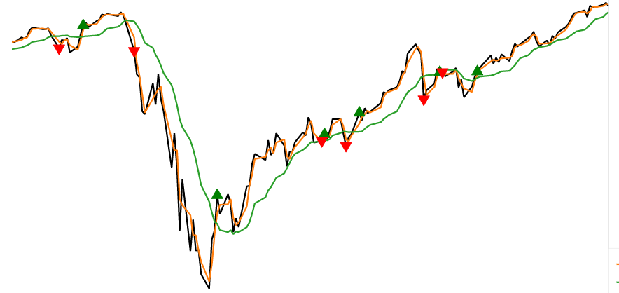

# Project 3 

**An algorithmic trading strategy that distributes profits to investors in Ether**

**PROCESS**

The diagram below shows our process flow. We pulled 20 years of data using Alpaca and Alphavantage. The data was cleaned and backtested to find a simple moving average strategy that we use to trade the S&P 500. We use a 2 day moving average with a 13 day moving average. Our algorithm sends BUY, HOLD, SELL signals directly to Alpaca for commission free execution.

On the first of the month we check Alpaca for profits. Profits are then calculated and sent back to the bank.

On the second of the month we send these profits to Binance, a cryptocurrency exchange to convert our profits to Ether. 

From Binance we send the Ether directly through the blockchain to a smart contract. This smart contract then divides the profits among team members. Team members receive their share of profits in their personal wallets in Ether.  

Alpaca and Binance have Know Your Customer requirements that require different levels of verification when depositing and withdrawing money that makes 100% automation difficult for now. Some interactions are represented by functions.

**SIMPLE MOVING AVERAGE STRATEGY USING THE S&P 500**

We backtested the 2-13 SMA crossover strategy in Python using the Backtesting library. We buy when the 2 day SMA goes above the 13 day SMA. We sell when the 2 day SMA goes below the 13 day SMA. The strategy beat a buy and hold strategy over the last three years. 

The strategy navigated the Coronavirus bear market very well. Green triangles are buy signals. Red triangles are sells. 

The strategy is very sensitive and produces numerous money losing whipsaws that make it a poor long-term strategy. However, in markets with volatility and numerous downdrafts with V shaped rallies, the strategy may do better. Going forward we see the election, a possible second wave of coronavirus, and further government intervention as sources of future volatility. 